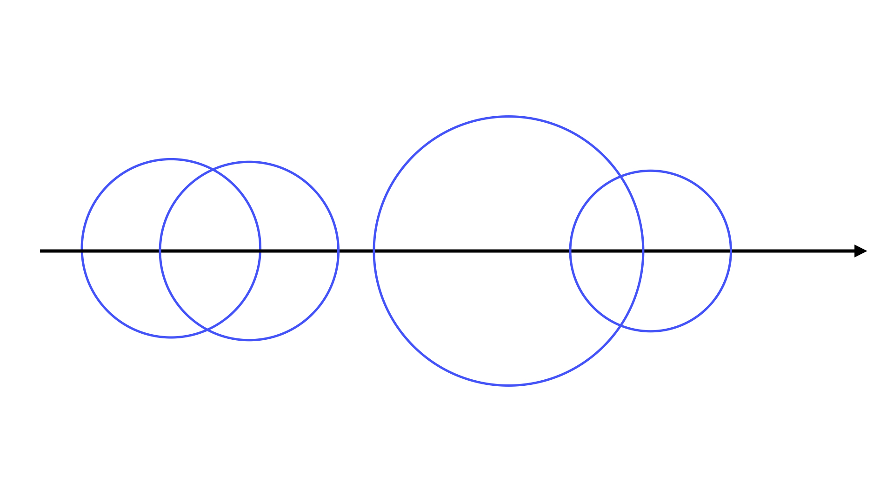
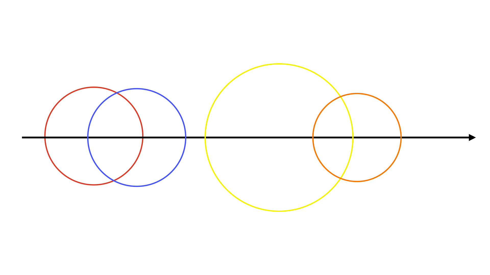
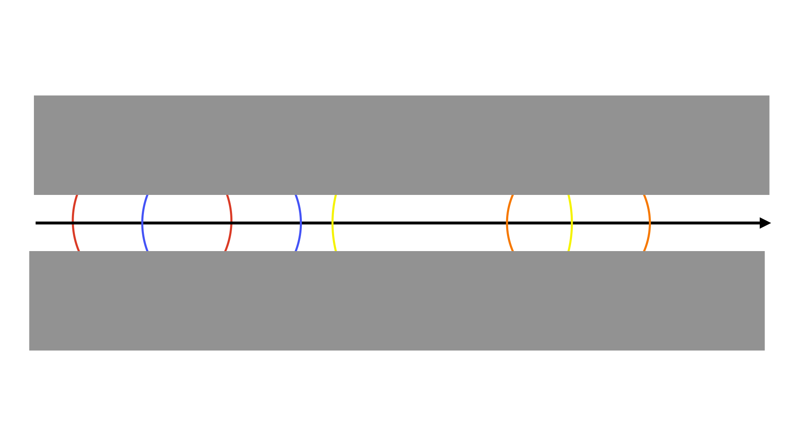
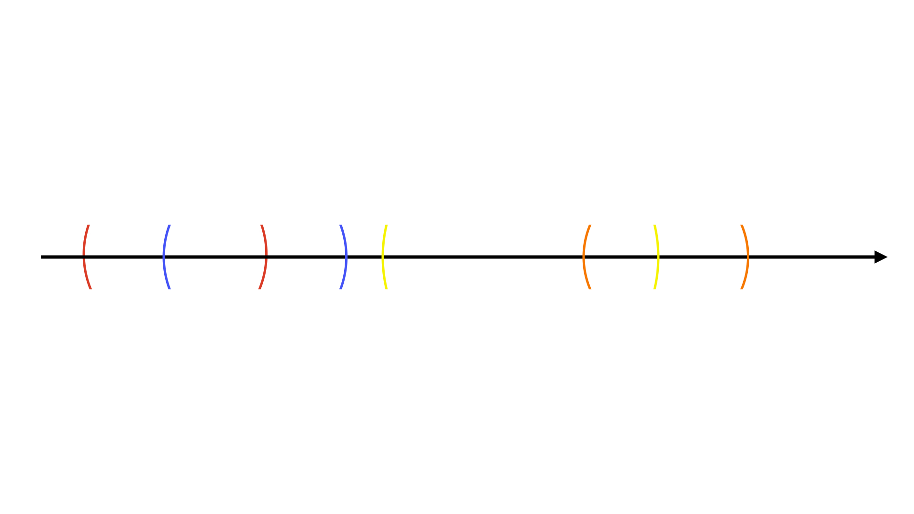
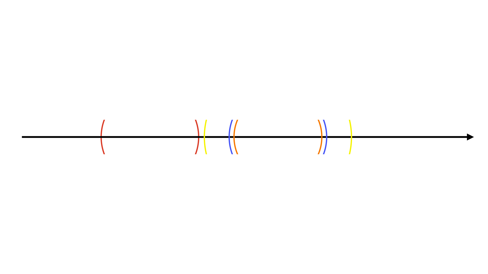
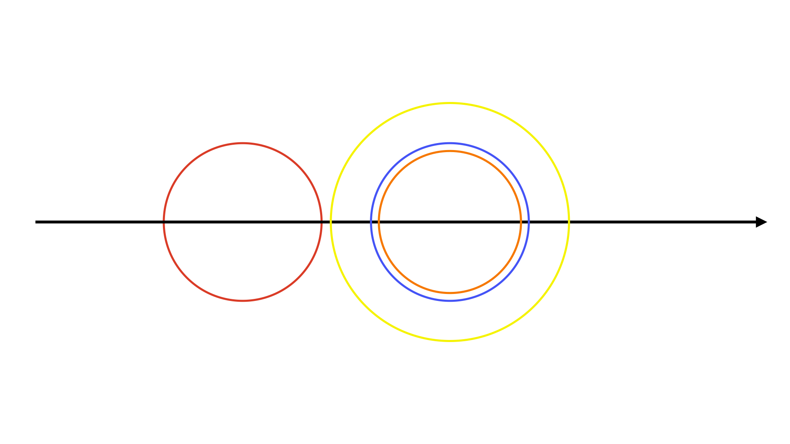

# 문제 00 : 데이터 체커

| 언어 | 소스 코드 |
| :--: | :-------: |
| Python | 준비중 |
| C++    | [바로가기](./main.cpp) |
| Java | 준비중 |

## 풀이

 - 스택, 정렬
 - 시간복잡도 : 

이 문제는 기하가 나와서 처음에 어렵게 느껴질 수 있습니다. 하지만, 이 문제는 다른 문제로 환원해서 풀 수 있습니다.  
그 전에 아래 그림을 보면서 생각해봅시다.  

</img>

위 그림의 경우는 올바른 데이터가 아닙니다. 왜냐면 교점이 존재하기 때문입니다.  
이를 확인하는 방법 중 가장 쉬운 것은 모든 쌍의 원을 잡고 교점이 존재하는지 확인하는 방법이 있습니다.  
하지만, 이 풀이는 시간복잡도가 이므로 주어진 시간안에 풀 수 없습니다.  

그러면 어떻게 해결할 수 있을까요?  
각 원에 고유의 색상으로 칠하고 윗 부분과 아랫 부분을 살짝 가려보겠습니다.  

</img>

</img>

혹시 어떤 것이 보이시나요?  
괄호가 보였다면 정답입니다. 이 문제는 괄호로 바꾸어 문제를 접근하면 쉬워집니다.

</img>

일단 괄호로 바꿨지만 그 다음을 어떻게 해야할지 생각을 해봅시다.  
이 문제를 풀기 위해서는 올바른 괄호인지 판별하는 것입니다.  
올바른 괄호인지 판별하는 기본문제는 [백준 9012](https://www.acmicpc.net/problem/9012)에서 풀어보실 수 있습니다. 또한, 올바른 괄호 문자열의 정의는 해당 문제를 보시면 됩니다.  

올바른 괄호 문자열인 것을 확인하기 위해서는 스택을 사용하면 됩니다. 위 그림에서 맨 왼쪽부터 괄호를 쭉 보면서 괄호 쌍이 맞는지 확인하면 풀리는 문제입니다.
위 경우에는 올바른 괄호가 아니기 때문에 어디선가 반드시 교점이 존재합니다.  

</img>

위 그림 경우에는 교점이 존재할까요 ?  
올바른 괄호이기 때문에 교점이 존재하지 않습니다.  

</img>

정리를 하자면, 이 문제는 원의 왼쪽 끝 부분과 오른쪽 끝 부분을 괄호로 바꾸어 올바른 괄호인지 확인하시면 됩니다.  
괄호로 바꿀 땐 x - d, x + d 값을 이용해서 정렬해서 괄호의 순서를 쉽게 정렬할 수 있습니다.
